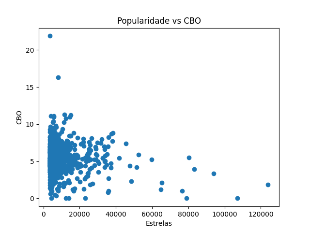
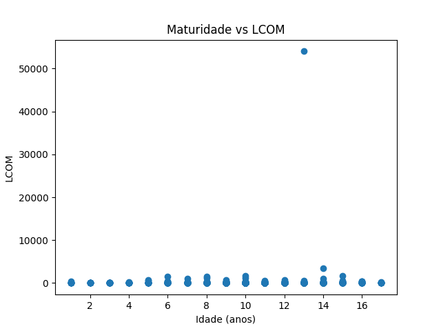
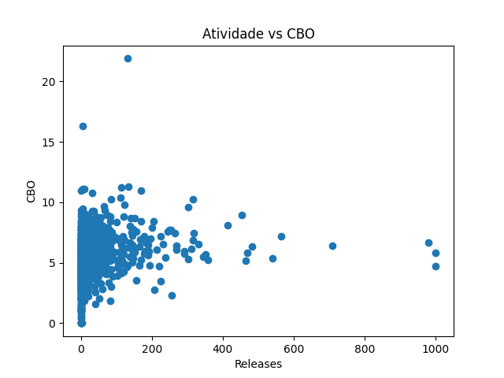

# LABORATÓRIO 02

## Um estudo das características de qualidade de sistemas Java

Disciplina: Laboratório de Experimentação de Software
Curso: Engenharia de Software — PUC Minas
Alunos: Lucas Carvalho Peres e Matheus Pretti

**Análise dos top-1.000 repositórios Java do GitHub**
*(972 repositórios analisados)*

---

# 1. Introdução

O desenvolvimento de software open-source envolve múltiplos contribuidores, diferentes padrões de codificação e evolução contínua dos sistemas. Nesse contexto, a qualidade interna do código torna-se um fator crítico para a manutenção e escalabilidade.

Este trabalho tem como objetivo analisar a relação entre métricas de processo — popularidade, maturidade, atividade e tamanho — e métricas de qualidade estrutural — CBO, DIT e LCOM — em repositórios Java populares do GitHub.

---

# 2. Metodologia

## 2.1 Coleta de Dados

Os dados foram coletados utilizando a API GraphQL do GitHub com a query:

```text
language:Java sort:stars-desc
```

Foram obtidos:

* Nome do repositório
* Número de estrelas
* Data de criação
* Número de releases

---

## 2.2 Processamento

Cada repositório foi processado individualmente seguindo as etapas:

1. Clone do repositório (`git clone --depth 1`)
2. Execução da ferramenta CK
3. Extração das métricas do arquivo `class.csv`
4. Agregação das métricas por repositório
5. Exclusão do repositório após análise

Essa abordagem evitou sobrecarga de armazenamento e travamentos.

---

## 2.3 Métricas Utilizadas

### Métricas de Processo

| Métrica  | Descrição    |
| -------- | ------------ |
| Stars    | Popularidade |
| Idade    | Maturidade   |
| Releases | Atividade    |
| LOC      | Tamanho      |

---

### Métricas de Qualidade

| Métrica | Descrição                 |
| ------- | ------------------------- |
| CBO     | Acoplamento entre classes |
| DIT     | Profundidade de herança   |
| LCOM    | Coesão entre métodos      |

---

## 2.4 Tratamento dos Dados

Para cada repositório, foram calculadas:

* Mediana de CBO
* Mediana de DIT
* Mediana de LCOM
* Soma total de LOC

A mediana foi utilizada devido à presença de outliers extremos, especialmente na métrica LCOM.

---

## 2.5 Análise Estatística

Foi utilizada a correlação de Spearman (ρ), adequada para dados não lineares e com distribuição assimétrica.

Critério de significância:

* p < 0,05 → significativo
* p ≥ 0,05 → não significativo

---

# 3. Resultados

---

# 3.1 RQ01 — Popularidade × Qualidade

### Resultados

| Métrica | ρ       | p-value | Resultado         |
| ------- | ------- | ------- | ----------------- |
| CBO     | +0.0374 | 0.2447  | Não significativo |
| DIT     | -0.0263 | 0.4140  | Não significativo |
| LCOM    | +0.0155 | 0.6303  | Não significativo |

---

### Gráfico



---

### Análise

Os resultados demonstram ausência de correlação entre popularidade e qualidade.

Os coeficientes próximos de zero indicam que o número de estrelas não influencia a estrutura interna do código.

O gráfico reforça essa conclusão, apresentando uma distribuição dispersa sem padrão definido.

Esse resultado evidencia que popularidade está mais relacionada à visibilidade e utilidade do projeto do que à qualidade estrutural.

---

# 3.2 RQ02 — Maturidade × Qualidade

### Resultados

| Métrica | ρ       | p-value | Resultado         |
| ------- | ------- | ------- | ----------------- |
| CBO     | +0.0158 | 0.6237  | Não significativo |
| DIT     | +0.0965 | 0.0026  | Significativo     |
| LCOM    | +0.0833 | 0.0095  | Significativo     |

---

### Gráfico



---

### Análise

A maturidade apresentou correlação estatisticamente significativa com DIT e LCOM, porém com baixa magnitude.

Isso indica que projetos mais antigos tendem a possuir estruturas ligeiramente mais complexas.

No entanto, o impacto é pequeno, o que demonstra que a idade do sistema não é um fator determinante da qualidade.

---

# 3.3 RQ03 — Atividade × Qualidade

### Resultados

| Métrica | ρ       | p-value | Resultado         |
| ------- | ------- | ------- | ----------------- |
| CBO     | +0.2844 | <0.001  | Significativo     |
| DIT     | -0.0392 | 0.2227  | Não significativo |
| LCOM    | +0.1123 | 0.0004  | Significativo     |

---

### Gráfico



---

### Análise

A atividade apresentou correlação positiva com CBO e LCOM, indicando que repositórios mais ativos tendem a ser mais complexos.

Esse resultado contraria a hipótese inicial, sugerindo que maior atividade não implica melhor qualidade, mas sim maior crescimento do sistema.

---

# 3.4 RQ04 — Tamanho × Qualidade

### Resultados

| Métrica | ρ       | p-value | Resultado         |
| ------- | ------- | ------- | ----------------- |
| CBO     | +0.2921 | <0.001  | Significativo     |
| DIT     | -0.0448 | 0.162   | Não significativo |
| LCOM    | +0.1559 | <0.001  | Significativo     |

---

### Análise

O tamanho apresentou a maior correlação com as métricas de qualidade.

Repositórios maiores tendem a apresentar maior acoplamento e menor coesão, o que é esperado devido ao aumento da complexidade estrutural.

A ausência de correlação com DIT reforça que a herança é uma decisão arquitetural independente do crescimento do sistema.

---

# 4. Discussão

Os resultados indicam que a qualidade de software não está diretamente relacionada à popularidade.

O principal fator associado à complexidade é o tamanho do sistema, enquanto a atividade atua como um indicador indireto de crescimento.

A maturidade apresentou impacto reduzido, indicando que o tempo de existência não implica necessariamente em degradação da qualidade.

---

# 5. Limitações

* Inclusão de classes de teste
* Limitações da ferramenta CK
* Presença de repositórios sem código relevante
* Correlação não implica causalidade

---

# 6. Considerações Finais

Este estudo demonstra que métricas de processo, como popularidade e atividade, não são indicadores confiáveis de qualidade interna.

O tamanho do sistema foi o fator mais relevante na explicação da complexidade estrutural.

---

# 7. Conclusão

A qualidade de software é multifatorial e não pode ser inferida a partir de métricas superficiais, reforçando a necessidade de análises estruturais mais profundas.

---
